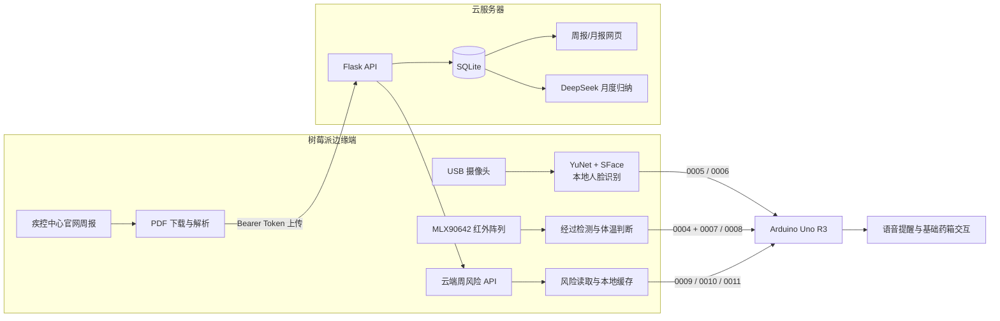

# 多场景 AI 智能药箱

面向家庭、社区及养老照护场景的智能用药辅助系统。项目以 Raspberry Pi 为边缘
计算核心，联合 USB 摄像头、MLX90642 红外阵列、Arduino Uno R3、语音模块与
云端服务，形成“身份确认—经过感知—体温提示—流感风险预警—信息展示”的协同
工作链路。

本仓库重点归档树莓派视觉与传感程序、Uno R3 固件、流感风险 API 及云端网页。
药箱的所有风险输出均用于健康信息提示，不替代医生诊断，也不会由 AI 自动修改
药品名称、剂量或处方。

## 项目亮点

- **边缘智能：** 人脸图像与身份模板保留在树莓派本地，不上传云端。
- **多传感协同：** USB 摄像头与红外阵列相互独立，单项故障不阻塞其他模块。
- **开放集人脸识别：** 只确认已注册用户，陌生人、多人和低质量画面均安全拒绝。
- **公共卫生风险服务：** 自动获取官方流感周报，完成解析、风险分级和网页展示。
- **端云分工：** 树莓派负责采集、识别和现场播报；云端负责 API、数据库、月报及
  用户访问。
- **统一串口协议：** 树莓派以四位数字指令控制 Uno R3 播放对应语音，并等待 ACK。
- **可审计决策：** 周风险等级由确定性规则产生；大模型仅用于月度文字归纳。

## 系统架构



## 功能组成

| 模块 | 核心功能 | 实现方式 | 当前状态 |
|---|---|---|---|
| 人脸识别 | 识别注册用户并选择用户档案 | USB 摄像头、YuNet、SFace、多帧决策 | 已完成并接入 Uno |
| 红外感知 | 检测人员经过并给出体温提示 | MLX90642、背景差分、热斑分析 | 已完成并接入 Uno |
| 流感风险 | 获取周报、规则分级、现场播报 | PDF 解析、云端 API、本地缓存 | 已完成端云链路 |
| AI 月报 | 归纳月内趋势、南北差异与防护建议 | DeepSeek API、结构化 JSON 校验 | 已接入云端网页 |
| 药箱控制 | 时钟、按键、显示、固定音频及串口接收 | Arduino Uno R3 | 基础功能及联合验收已完成 |

> 药品识别属于项目的独立视觉模块，目前未在本仓库中归档。本仓库不会将人脸识别
> 结果直接解释为“已经服药”。

## AI 与算法边界

项目中的“智能”并非全部依赖大模型，而是由不同算法按任务分工：

### 1. 人脸识别

- YuNet 负责人脸检测与关键点定位；
- SFace 负责人脸特征提取和余弦相似度计算；
- 程序执行亮度、清晰度、人脸尺寸、多帧投票和超时判断；
- 不调用大语言模型，不上传日常人脸画面。

### 2. 红外经过与体温提示

- 使用 24×32 红外温度帧进行背景差分和热斑分析；
- 通过冷却期抑制同一人员停留期间的重复触发；
- 体温阈值用于演示提示，不等同于医疗级体温诊断。

### 3. 流感风险评估

- 周风险等级由阳性率、变化趋势、暴发数量和耐药指标的确定性规则生成；
- 相同输入始终得到相同结果，便于复核和比赛答辩说明；
- DeepSeek 只对一个月内的周报进行文字归纳，不参与个人诊断和用药决策。

## 主要业务流程

### 人脸识别

```text
USB 摄像头取帧
→ 人脸数量与画面质量检查
→ YuNet 检测与五点对齐
→ SFace 特征比对
→ 3 至 5 帧连续决策
→ 已注册用户发送 0005，其他或失败状态发送 0006
```

### 红外感知

```text
红外阵列读取温度帧
→ 检测到人员经过
→ 向 Uno 发送 0004“请吃药”
→ 完成温度判断
→ 体温过高发送 0007，体温正常发送 0008
```

### 每周流感预警

```text
每周一 10:00 触发 systemd timer
→ 树莓派从官网下载最新 PDF
→ 解析监测指标并上传云端
→ 云端复核风险等级、保存 PDF 和数据
→ 网页更新并提供周报、图表和 AI 月报
→ 树莓派读取最新风险
→ 高/中/低风险发送 0009/0010/0011
```

更新、解析或上传任一步失败时，任务返回非零退出码，不会继续使用旧数据执行成功后
播报。网络异常时，风险客户端可以读取本地缓存，但会明确标记 `stale=true`。

## 串口通信协议

- 波特率：`9600`
- 格式：`8N1`
- 指令：4 位 ASCII 数字，以 `\n` 结束
- Uno 接收有效指令并加入播放队列后回复 `ACK\n`
- ACK 等待时间：2 秒

| 指令 | 含义 |
|---|---|
| `0004` | 有人经过，请吃药 |
| `0005` | 人脸识别成功 |
| `0006` | 人脸识别失败 |
| `0007` | 体温过高 |
| `0008` | 体温正常 |
| `0009` | 流感高风险 |
| `0010` | 流感中风险 |
| `0011` | 流感低风险 |

详细协议见 [R3 串口通信对接说明](R3串口通信对接说明.md)。

## 端云职责

### Raspberry Pi

- 运行 USB 摄像头人脸识别；
- 读取 MLX90642 红外帧；
- 每周下载并解析流感周报；
- 调用云端只读 API 并保存风险缓存；
- 统一向 Uno R3 发送音频编号。

### 云服务器

- 接收树莓派通过 Bearer Token 上传的周报和原始 PDF；
- 保存周报、规则风险与 AI 月报；
- 提供网页、图表、原始 PDF 和查询 API；
- 保存 DeepSeek API Key 与周报上传令牌；
- 面向用户提供持续访问入口。

### Arduino Uno R3

- 负责时钟、按键、显示和基础药箱交互；
- 接收树莓派四位数字指令并播放固定音频；
- 不执行人脸识别、红外分析或大模型调用。

## 仓库结构

```text
medicine-box-face-demo/
├── cloud/flu_web/                 云端 API、网页、数据库与 AI 月报
├── deploy/systemd/                树莓派服务和每周定时任务
├── firmware/uno_r3/               Uno R3 归档固件
├── models/                        YuNet 与 SFace 模型
├── scripts/                       模型下载、硬件检查和日志启动脚本
├── src/facebox/
│   ├── app.py                     统一命令入口
│   ├── camera.py                  USB/Picamera2 摄像头适配
│   ├── opencv_engine.py           人脸检测、对齐与特征提取
│   ├── decision.py                多帧开放集决策
│   ├── thermal.py                 红外帧解析与经过检测
│   ├── thermal_app.py             红外运行与日志流程
│   ├── flu_api.py                 云端风险 API 客户端及缓存
│   ├── flu_app.py                 风险查询和 Uno 播报流程
│   └── uno.py                     串口协议、文件锁和 ACK 处理
├── tests/                          无硬件自动化测试
├── workers/flu_updater/            树莓派周报下载、解析和上传任务
├── config.json                     摄像头、识别和 API 参数
└── README_树莓派操作说明.md          树莓派安装与运行指南
```

仅查看流感预警与 API 基础源码，可切换到
[`flu-risk-api-minimal`](https://github.com/hun01108-eng/medicine-box-face-demo/tree/flu-risk-api-minimal)
分支。

## 快速验证

无需连接摄像头、红外阵列或 Uno：

```bash
PYTHONPATH=src python3 -m unittest discover -s tests -v
PYTHONPATH=src python3 -m facebox.app simulate --case known
PYTHONPATH=src python3 -m facebox.app thermal-monitor --simulate
```

当前自动化回归覆盖人脸决策、画面质量、模板、流感 API 缓存、红外检测和 Uno
协议及比赛演示调度。

## 比赛演示程序

统一演示入口为 `scripts/competition_demo.py`。正式运行前先在
`demo_config.json` 中填写红外模块和 Uno 的 `/dev/serial/by-id/` 稳定路径；
药品识别尚未归档，因此通过 `medicine_command` 接入独立程序，留空时会明确跳过。
工程安装后也可使用等价命令 `medicine-box-demo`。

演示前自检：

```bash
python3 scripts/competition_demo.py self-check
```

按“红外经过与体温—人脸识别—药品识别—流感预警—网页展示”的顺序运行：

```bash
python3 scripts/competition_demo.py run --display --open-web
```

无硬件、无网络的完整模拟：

```bash
python3 scripts/competition_demo.py simulate
```

单独演示某一模块：

```bash
python3 scripts/competition_demo.py thermal
python3 scripts/competition_demo.py face --display
python3 scripts/competition_demo.py medicine
python3 scripts/competition_demo.py flu
python3 scripts/competition_demo.py serial --code 0009
```

每次运行都会在 `logs/demo_日期时间.json` 保存步骤状态、耗时、音频编号和 ACK，
不保存人脸图片。模拟结果始终标记为“模拟”，不会冒充实机结果。

树莓派安装、注册、摄像头运行和硬件检查命令见
[树莓派操作说明](README_树莓派操作说明.md)。

## 当前进度

已完成：

- USB 摄像头人脸识别、多帧安全决策及 Uno `0005/0006` 联动；
- MLX90642 人员经过检测、体温提示及 Uno `0004/0007/0008` 联动；
- Uno R3 基础功能、串口协议与硬件联合验收；
- 官方流感周报下载、解析、规则分级、云端上传和原始 PDF 保存；
- 云端周报/月报网页、图表与查询 API；
- DeepSeek 月度分析及返回结构校验；
- 每周一 10:00 自动更新及 `0009/0010/0011` 风险播报；
- 树莓派端断网缓存、进程间串口互斥和 systemd 自启动配置；
- 42 项无硬件自动化测试通过。

后续工作：

- 使用更多真实人员和不同光照数据继续标定人脸阈值；
- 在最终安装结构下标定红外温度偏移、距离和环境阈值；
- 为云端配置正式域名、HTTPS、备份和运行监控；
- 完成长时间运行、异常断网恢复和电源稳定性测试；
- 将独立药品识别模块统一归档并补充端到端演示流程。

## 隐私与安全边界

- 日常摄像头画面只在内存中处理，不默认保存图片或视频；
- 注册图片、身份模板、数据库、PDF 缓存、日志和密钥均不提交到 Git；
- 陌生人、多人、低质量画面和超时均不会加载个人用药档案；
- 当前版本不具备可靠活体检测，不能作为强身份认证系统；
- 红外结果不是医疗级体温诊断；
- 流感风险是群体监测信息，不代表个人患病概率；
- AI 不生成处方，也不自动修改药物和剂量。

## 相关文档

- [树莓派操作说明](README_树莓派操作说明.md)
- [R3 串口通信对接说明](R3串口通信对接说明.md)
- [流感风险评估与 API 模块说明](FLU_RISK_MODULE.md)
- [部署记录](DEPLOYMENT.md)

## 技术参考

- [OpenCV DNN 人脸检测与识别](https://docs.opencv.org/4.x/d0/dd4/tutorial_dnn_face.html)
- [OpenCV Zoo：YuNet](https://github.com/opencv/opencv_zoo/tree/main/models/face_detection_yunet)
- [OpenCV Zoo：SFace](https://github.com/opencv/opencv_zoo/tree/main/models/face_recognition_sface)
- [Raspberry Pi Picamera2 Manual](https://datasheets.raspberrypi.com/camera/picamera2-manual.pdf)
