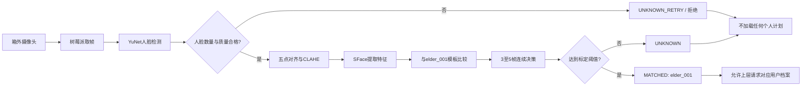
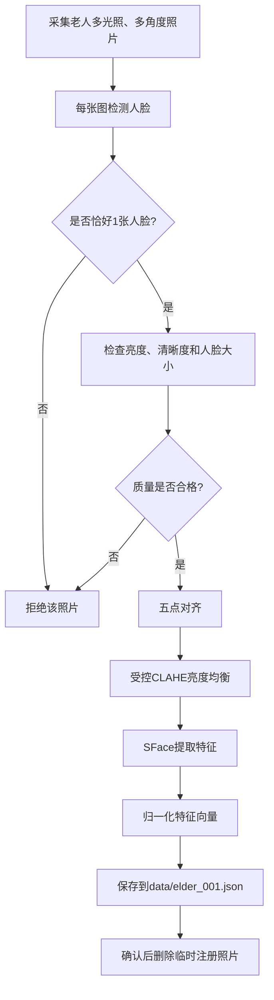

# 智能药箱箱外单人脸识别 Demo

这是智能药箱第三板块的树莓派软件原型。系统通过药箱外部摄像头识别唯一注册老人，并输出确定性的身份状态，为后续个性化用药服务选择用户档案。

> 人脸识别在本项目中只是**用户档案选择器**。它不识别药品，不生成或修改药名、剂量，也不能证明老人已经服药。

## 一、项目目标

第一阶段只实现最小可演示版本：

```text
注册1位老人 elder_001
→ 摄像头发现人脸
→ 在不同室内光照下进行检测和比对
→ 基本在3秒内输出结果
→ 匹配成功输出 MATCHED / elder_001
→ 其他人员统一输出 UNKNOWN
→ 不确定、画面质量差或多人出现时安全拒绝
```

当前阶段不追求多人脸库、大规模身份检索或复杂云端服务，优先保证流程简单、结果可解释、陌生人不会被强制归入已注册老人。

## 二、总体思路

系统采用“轻量人脸检测＋人脸特征比对＋多帧安全决策”的传统视觉方案，不使用大语言模型或大型视觉模型判断身份。

- **树莓派：**摄像头取帧、人脸检测、图像质量检查、特征提取、身份比对和结果输出；
- **YuNet：**定位人脸并给出五点关键点；
- **SFace：**对齐人脸、提取特征向量并计算相似度；
- **确定性决策程序：**控制相似度阈值、多帧投票、超时和安全拒绝；
- **Arduino Uno：**后续继续负责原药箱的时钟、按键、OLED、LED和固定音频，不承担图像处理。



## 三、为什么选择YuNet＋SFace

第一版需要在树莓派CPU上运行，并尽量在3秒内完成识别，因此模型必须轻量且能够离线工作。

- YuNet适合实时人脸检测，能够输出后续对齐所需的关键点；
- SFace把人脸转换为固定长度特征，不需要为一个人重新训练分类模型；
- 注册模板可以提前计算，运行时只需进行特征提取和余弦相似度比较；
- 模型完全在树莓派本地运行，不需要上传摄像头画面；
- OpenCV提供统一接口，便于Python原型后续迁移到C++。

工程中已经包含来自OpenCV官方模型仓库的YuNet和SFace ONNX文件及SHA-256校验脚本。

## 四、注册流程

注册必须由老人本人或监护人主动启动。



推荐注册场景：

- 普通室内正脸；
- 明亮环境正脸；
- 较暗环境正脸；
- 左侧光和右侧光；
- 轻微左转和轻微右转；
- 老人平时戴眼镜时增加戴眼镜样本。

程序不会把注册原图复制到模板中，只保存归一化后的人脸特征向量。特征向量仍然属于敏感个人信息，必须限制访问并支持删除。

## 五、运行时程序逻辑

### 1. 人脸数量判断

- 没有人脸：保持`WAITING`，不启动身份会话；
- 只有一张人脸：进入质量检查；
- 同时出现多张人脸：立即返回`UNKNOWN_RETRY / multiple_faces`，不选择其中任何一人。

### 2. 图像质量门禁

程序当前检查：

- 人脸框宽度是否达到要求；
- 人脸区域平均亮度是否过低；
- 是否严重过曝；
- 拉普拉斯方差是否表明画面模糊。

质量不合格的帧不参与身份投票。系统继续等待更清晰的画面，达到3秒超时后拒绝本次识别。

### 3. 特征比对

质量合格后：

1. 根据YuNet关键点对齐人脸；
2. 在亮度通道执行受控CLAHE；
3. 使用SFace生成特征向量；
4. 与`elder_001`的多个注册模板分别计算余弦相似度；
5. 取最佳模板相似度交给多帧决策模块。

### 4. 多帧决策

默认参数：

```json
{
  "similarity_threshold": 0.55,
  "required_matches": 3,
  "max_valid_frames": 5,
  "timeout_seconds": 3.0
}
```

决策规则：

```text
3个有效帧达到阈值
→ MATCHED / elder_001

收集满5个有效帧仍不足3个匹配
→ UNKNOWN

画面质量持续不合格或处理超过3秒
→ UNKNOWN_RETRY

多人同时出现
→ UNKNOWN_RETRY
```

`0.55`只是首轮保守起点，不是最终安全阈值。最终阈值必须使用实际老人样本和多位非注册人员数据进行标定，不能因为暗光识别失败就盲目降低阈值。

## 六、多光照处理方案

多光照准确性不能只依赖模型，应同时从安装、注册、预处理和决策四层处理。

### 1. 摄像头安装

- 固定摄像头高度、俯仰角和识别距离；
- 避免摄像头正对窗户；
- 让老人脸部在画面中占有足够像素；
- 可增加柔和白光补光和扩散罩；
- 默认使用 USB 摄像头 `/dev/video0`；必须实测安装距离下的人脸清晰度。

### 2. 注册数据

使用同一台摄像头、相近安装距离，采集明亮、普通、较暗和侧光模板，避免只注册一张正面照片。

### 3. 图像预处理

程序在人脸对齐后对亮度通道执行CLAHE，以减轻局部阴影和亮度不均。严重欠曝、过曝或模糊画面不会被强行增强后放行，而是进入重试。

### 4. 多帧确认

单帧光照波动不会立即决定身份。只有多个有效帧达到阈值才输出`MATCHED`，结果不稳定时安全拒绝。

## 七、3秒识别目标

3秒从**首次检测到画面中出现人脸**开始计算，不包括树莓派开机、程序冷启动、模型加载和摄像头启动。

程序采用以下方式降低延迟：

- 摄像头保持运行；
- YuNet和SFace在启动时一次性加载；
- 注册模板提前计算；
- 只对检测到的单张合格人脸运行SFace；
- 达到3个匹配帧后立即返回，不等待收集满5帧；
- 默认使用640×480摄像头画面；
- 提供20次P50/P95实机基准命令。

目标验收条件：

```text
明亮、普通、较暗、侧光、逆光分别测试
已注册老人：记录成功率及P95延迟
非注册人员：检查是否被错误放行
目标：有效画面下P95识别延迟不超过3秒
```

当前3秒目标尚未在实际树莓派和摄像头上验证，必须以`benchmark`命令的实机结果为准。

## 八、身份状态与安全含义

| 状态 | 含义 | 上层处理 |
|---|---|---|
| `WAITING` | 尚未获得足够信息 | 继续观察，不加载计划 |
| `MATCHED` | 多帧确认注册老人 | 允许请求`elder_001`档案 |
| `UNKNOWN` | 有效人脸与模板不匹配 | 拒绝加载个人计划 |
| `UNKNOWN_RETRY` | 暗光、模糊、多人或超时 | 提示重新站位或人工处理 |
| `ERROR` | 模型、模板或摄像头错误 | 停止个性化流程 |

示例成功输出：

```json
{
  "status": "MATCHED",
  "user_id": "elder_001",
  "confidence": 0.66,
  "reason": "",
  "valid_frames": 3,
  "matching_frames": 3,
  "latency_seconds": 0.4
}
```

其中`confidence`是人脸相似度，不是“服药安全概率”。

## 九、软件结构

```text
medicine-box-face-demo/
├── cloud/flu_web/              云端网页、数据库接口与受保护接收端
├── workers/flu_updater/        树莓派官网周报下载、解析和上传任务
├── README.md                    项目思路、方案与程序逻辑
├── README_树莓派操作说明.md       安装、注册、运行和测试命令
├── config.json                 模型、摄像头、质量与决策参数
├── models/                     YuNet与SFace官方ONNX模型
├── enrollment_images/          临时注册照片目录
├── scripts/download_models.py  模型下载和SHA-256校验
├── src/facebox/
│   ├── app.py                  CLI入口与运行流程
│   ├── camera.py               Picamera2/OpenCV摄像头适配
│   ├── opencv_engine.py        检测、质量计算、对齐与特征提取
│   ├── decision.py             多帧开放集身份决策
│   ├── quality.py              亮度、清晰度和尺寸门禁
│   ├── templates.py            特征模板保存与余弦比对
│   ├── session.py              后续集成用身份会话过期模块
│   ├── metrics.py              P50/P95延迟统计
│   └── types.py                状态和数据结构
└── tests/                      无摄像头自动测试
```

`session.py`已准备身份离场失效逻辑，但当前单次Demo在给出一个终态结果后直接退出；与完整药箱状态机集成时再把会话模块接入持续运行流程。

## 十、快速体验

无需摄像头运行自动测试：

```bash
PYTHONPATH=src python3 -m unittest discover -s tests -v
```

模拟已注册老人：

```bash
PYTHONPATH=src python3 -m facebox.app simulate --case known
```

模拟陌生人和异常情况：

```bash
PYTHONPATH=src python3 -m facebox.app simulate --case unknown
PYTHONPATH=src python3 -m facebox.app simulate --case dark
PYTHONPATH=src python3 -m facebox.app simulate --case multiple
PYTHONPATH=src python3 -m facebox.app simulate --case timeout
```

真实注册、摄像头运行和基准测试命令请阅读：

- [README_树莓派操作说明.md](README_树莓派操作说明.md)

## 十一、隐私与医疗安全边界

- 普通运行时原始帧只在内存中短暂处理；
- 源码不调用`imwrite`或`VideoWriter`；
- 默认不保存日常截图、视频或人脸图像日志；
- `enrollment_images/`中的注册照片不会提交到Git；
- `data/elder_001.json`人脸模板不会提交到Git；
- `UNKNOWN`、超时、多人、低质量或错误状态均不得加载个人计划；
- 人脸识别不能确认谁最终取了药或实际服用了药；
- 人脸模块和AI均不得决定、生成或修改药品名称和剂量；
- 第一版没有可靠活体检测，不能防止照片或手机屏幕冒用，不能宣传为强身份认证。

## 十二、当前进度

已完成：

- 单人开放集决策框架；
- YuNet＋SFace接口；
- 默认 USB 摄像头输入，同时保留 Picamera2 兼容适配层；
- 多光照注册模板支持；
- 图像质量门禁；
- 多帧确认和3秒超时；
- 身份模板最小化存储；
- P50/P95基准工具；
- 18项无硬件自动测试；
- 5种模拟识别路径；
- 官方模型文件校验。

待树莓派实机完成：

1. 确认 USB 摄像头设备名并验证 `/dev/video0` 取帧；
2. 采集老人多光照注册样本；
3. 使用老人和多位陌生人数据标定阈值；
4. 测试明亮、普通、较暗、侧光和逆光；
5. 测量20次以上识别的P50/P95延迟；
6. 根据实测结果调整补光、安装距离和质量阈值；
7. 最后再接入Arduino药箱和个性化计划状态机。

## 十三、参考资料

- [OpenCV DNN人脸检测与识别教程](https://docs.opencv.org/4.x/d0/dd4/tutorial_dnn_face.html)
- [OpenCV Zoo：YuNet](https://github.com/opencv/opencv_zoo/tree/main/models/face_detection_yunet)
- [OpenCV Zoo：SFace](https://github.com/opencv/opencv_zoo/tree/main/models/face_recognition_sface)
- [树莓派Picamera2说明文档](https://datasheets.raspberrypi.com/camera/picamera2-manual.pdf)

## 十四、红外经过检测与 Uno 通知

仓库现在同时包含 MLX90642-mini 红外阵列的人体经过检测。红外模块和
USB 人脸摄像头相互独立：人脸识别命令保持不变，红外检测通过 USB
串口读取 24×32 温度帧，并在确认有人经过时向 Arduino Uno 发送：

```text
PERSON_IN\n
```

Uno 可返回 `ACK\n`。树莓派无论是否收到 ACK 都会把事件和确认结果写入
`logs/person_events.csv`，但同一个人停留期间不会反复发送。

树莓派建议使用 `/dev/serial/by-id/` 下的稳定路径区分红外模块和 Uno：

```bash
ls -l /dev/serial/by-id/
PYTHONPATH=src python3 -m facebox.app thermal-monitor \
  --thermal-port /dev/serial/by-id/<thermal-device> \
  --uno-port /dev/serial/by-id/<uno-device>
```

无硬件时可以验证状态机和日志：

```bash
PYTHONPATH=src python3 -m facebox.app thermal-monitor --simulate
```

当前红外算法是背景差分和热斑检测，不是人脸定位或医用测温。`offset`、
温度门槛和面积范围必须在实际安装距离与环境中重新标定。

## 十五、云端流感风险 API

流感网站继续在云服务器上完成官网 PDF 下载、周报入库、DeepSeek 分析和网页展示。
树莓派只读取网站的只读接口 `/api/weekly`，不保存 DeepSeek API Key，也不在本地
重复生成月报。这样人脸图像和模板留在设备内，流感数据仍由云端统一维护。

三个功能使用同一个 CLI，但保持彼此独立，单项故障不会阻塞其他传感器：

```text
USB摄像头 -> facebox run       -> 身份结果
MLX90642 -> thermal-monitor    -> PERSON_IN / Uno
云端网站 -> flu-status/monitor -> 高、中、低风险 + 本地缓存
```

单次读取当前风险：

```bash
PYTHONPATH=src python3 -m facebox.app flu-status
```

常驻轮询（默认每小时一次，只在内容变化时输出）：

```bash
PYTHONPATH=src python3 -m facebox.app flu-monitor
```

接口地址、超时、轮询间隔和缓存位置在 `config.json` 的 `flu_api` 节配置；临时切换
服务器可设置 `FLU_API_BASE_URL` 或使用 `--api-base-url`。云端断开时输出中的
`source` 为 `cache` 且 `stale` 为 `true`，调用方必须把它显示为缓存数据。

当前服务器使用 HTTP，适合先完成局域/演示联调；正式公网使用时应配置域名和 HTTPS。
风险等级目前只输出和缓存，不会自动修改药物、剂量，也不会擅自触发 Uno 动作。

电脑端原有的周报更新流程已整理到 `workers/flu_updater/`，可在树莓派上下载、
解析并通过带令牌的接口上传云服务器；网页、主数据库和 DeepSeek 密钥仍留在云端。
该更新器与人脸识别、红外检测互不占用摄像头或串口。
